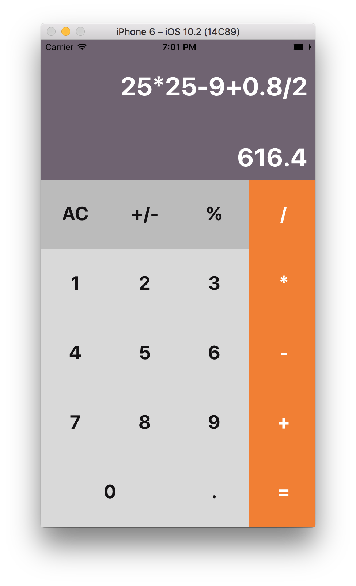

## Simple calculator
#### This is my first react native app, only 300 strings of code.



The whole code is in folder Components. Check ```Calc.js```
and ```Buttons.js```

To run you should have ```npm``` and ```react-native``` installed

```
npm install
react-native run-ios
```
